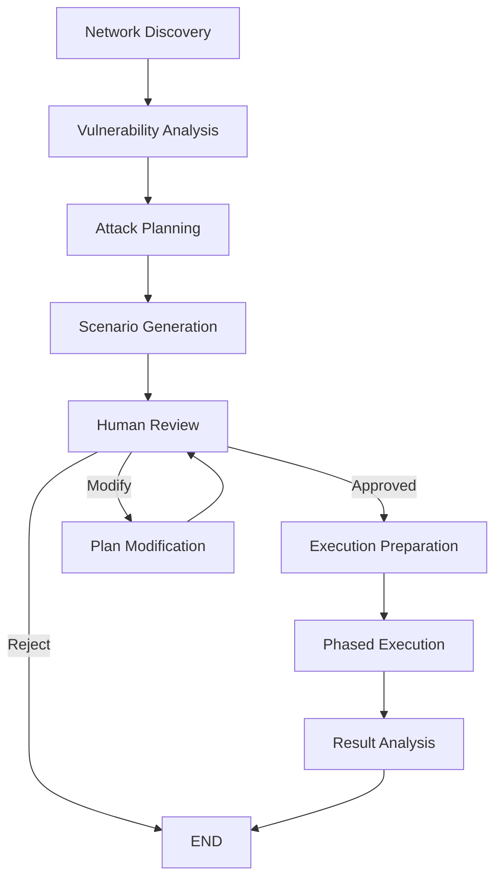

# 🤖 AI ATTACK AGENT WITH LANGGRAPH - COMPLETE DOCUMENTATION

## 🎯 **WHAT'S NEW: TRUE AI ATTACKER**

Your Attack Agent is now a **fully autonomous AI attacker** that:
- **Discovers** your network topology automatically
- **Plans** sophisticated multi-phase attacks based on actual endpoints
- **Generates** custom attack scenarios using AI
- **Waits** for human approval before execution
- **Allows** modification of attack parameters
- **Executes** attacks intelligently, not just 13 fixed techniques

---

## 🔄 **LANGGRAPH WORKFLOW ARCHITECTURE**



### **Workflow Nodes**

1. **Network Discovery**
   - Queries all online agents
   - Maps network topology
   - Identifies critical systems

2. **Vulnerability Analysis**
   - AI analyzes each endpoint
   - Identifies potential vulnerabilities
   - Maps attack vectors

3. **Attack Planning**
   - Creates comprehensive APT-style plan
   - 10 phases (Initial Access → Exfiltration)
   - Tailored to discovered network

4. **Scenario Generation**
   - Generates 3 attack scenarios:
     - Stealthy APT (low and slow)
     - Ransomware (fast and noisy)
     - Data Exfiltration (targeted)

5. **Human Review** ⚠️ **APPROVAL REQUIRED**
   - Presents scenarios to user
   - Waits for approval/modification
   - Allows parameter changes

6. **Phased Execution**
   - Executes approved scenario
   - Phase-by-phase progression
   - Real-time monitoring

---

## 📡 **API ENDPOINTS**

### **1. Start AI Attack Workflow**
```http
POST /api/ai-attack/start
{
    "objective": "Comprehensive security assessment of finance department"
}

Response:
{
    "workflow_id": "abc-123",
    "status": "started",
    "message": "Network discovery in progress..."
}
```

### **2. Get Attack Status**
```http
GET /api/ai-attack/status/{workflow_id}

Response:
{
    "status": "awaiting_approval",
    "network_topology": {...},
    "available_endpoints": 25,
    "attack_scenarios": [...]
}
```

### **3. Get Generated Scenarios**
```http
GET /api/ai-attack/scenarios/{workflow_id}

Response:
{
    "scenarios": [
        {
            "id": "scenario_1",
            "name": "Operation Silent Storm - APT Simulation",
            "techniques": ["T1055", "T1003", "T1021"],
            "targets": ["DC-01", "SQL-SERVER", "FILE-SHARE"],
            "impact": "high",
            "detection_risk": "low",
            "duration": "3 hours"
        },
        ...
    ]
}
```

### **4. Approve Scenario** ✅
```http
POST /api/ai-attack/approve/{workflow_id}
{
    "scenario_id": "scenario_1"
}

Response:
{
    "status": "approved",
    "message": "Attack execution starting..."
}
```

### **5. Modify Scenario** ✏️
```http
POST /api/ai-attack/modify/{workflow_id}
{
    "modifications": {
        "targets": ["DC-01", "WEB-SERVER"],
        "duration": "1 hour",
        "techniques": ["T1055", "T1003"]
    }
}

Response:
{
    "status": "modified",
    "message": "Scenario modified. Please review."
}
```

### **6. Get Results**
```http
GET /api/ai-attack/results/{workflow_id}

Response:
{
    "execution_results": [...],
    "timeline_entries": 15,
    "status": "completed"
}
```

---

## 🎮 **HOW IT WORKS - COMPLETE FLOW**

### **Phase 1: Automatic Network Discovery**
```python
# AI discovers your actual network
- Queries all registered agents
- Maps network topology
- Identifies:
  * Domain controllers
  * Database servers
  * Web servers
  * Workstations
  * Network devices
```

### **Phase 2: AI Vulnerability Analysis**
```python
# AI analyzes each endpoint
For each endpoint:
  - Platform vulnerabilities (Windows/Linux/macOS)
  - Service vulnerabilities (SMB, RDP, SSH)
  - Application vulnerabilities (SQL, Web)
  - Privilege escalation paths
  - Lateral movement opportunities
```

### **Phase 3: Intelligent Attack Planning**
```python
# AI creates custom attack plan
Attack Plan:
  Phase 1: Initial Access
    - Targets: [Endpoint with internet exposure]
    - Techniques: [Phishing, Valid Accounts]
  
  Phase 2: Execution
    - Targets: [Compromised endpoints]
    - Techniques: [PowerShell, Scheduled Tasks]
  
  Phase 3: Persistence
    - Targets: [Critical servers]
    - Techniques: [Registry Keys, Services]
  
  ... (7 more phases)
```

### **Phase 4: Scenario Generation**
```python
# AI generates 3 different scenarios
Scenario 1: "APT Simulation"
  - Mimics nation-state actors
  - Low and slow approach
  - Focus on stealth
  
Scenario 2: "Ransomware Simulation"
  - Fast propagation
  - Encryption simulation
  - High impact
  
Scenario 3: "Data Theft Simulation"
  - Target databases
  - Exfiltration paths
  - Minimal detection
```

### **Phase 5: Human Approval Required** 🛑
```python
# System waits for user decision
Options:
  1. APPROVE - Execute as-is
  2. MODIFY - Change parameters
  3. REJECT - Cancel operation

User can modify:
  - Target endpoints
  - Attack techniques
  - Execution timing
  - Impact level
```

### **Phase 6: Intelligent Execution**
```python
# AI executes approved plan
For each phase:
  - Select best technique for target
  - Generate custom payloads
  - Execute with evasion
  - Monitor detection
  - Adapt if blocked
  - Report results
```

---

## 🧠 **AI CAPABILITIES**

### **What Makes It "AI"?**

1. **Dynamic Planning**
   - No hardcoded scenarios
   - Plans based on YOUR network
   - Adapts to discovered topology

2. **Intelligent Target Selection**
   ```python
   # AI prioritizes targets
   - High-value: Domain controllers, databases
   - Vulnerable: Unpatched systems
   - Strategic: Jump boxes, admin workstations
   ```

3. **Technique Selection**
   ```python
   # AI chooses techniques based on:
   - Target platform (Windows/Linux/macOS)
   - Available services
   - Detection capabilities
   - Success probability
   ```

4. **Adaptive Execution**
   ```python
   # During execution:
   - If technique fails → Try alternative
   - If detected → Switch to stealthy mode
   - If blocked → Find bypass
   ```

---

## 🎯 **EXAMPLE: REAL ATTACK WORKFLOW**

### **Step 1: Start Workflow**
```bash
curl -X POST https://dev.codegrey.ai:443/api/ai-attack/start \
  -H "Authorization: Bearer soc-prod-..." \
  -H "Content-Type: application/json" \
  -d '{"objective": "Test finance department security"}'
```

### **Step 2: AI Discovers Network**
```
Found 25 endpoints:
- DC-01 (Domain Controller)
- SQL-FIN-01 (Finance Database)
- WEB-FIN-01 (Finance Portal)
- 22 workstations
```

### **Step 3: AI Generates Scenarios**
```
Scenario 1: "Silent Finance Breach"
- Initial compromise via phishing
- Credential harvesting from workstations
- Lateral movement to SQL-FIN-01
- Data exfiltration via HTTPS
```

### **Step 4: User Reviews**
```
Review scenarios at: /api/ai-attack/scenarios/abc-123
Modify targets if needed
Approve when ready
```

### **Step 5: User Approves**
```bash
curl -X POST https://dev.codegrey.ai:443/api/ai-attack/approve/abc-123 \
  -d '{"scenario_id": "scenario_1"}'
```

### **Step 6: AI Executes**
```
Phase 1: Compromised WORKSTATION-05 via phishing simulation
Phase 2: Harvested credentials using Mimikatz
Phase 3: Moved laterally to SQL-FIN-01
Phase 4: Simulated data exfiltration (no actual data taken)
Attack complete: 87% success rate
```

---

## 🔧 **CUSTOMIZATION OPTIONS**

### **User Can Modify:**

1. **Target Selection**
   ```json
   {
     "modifications": {
       "targets": ["DC-01", "SQL-FIN-01"],
       "exclude": ["CEO-LAPTOP"]
     }
   }
   ```

2. **Technique Selection**
   ```json
   {
     "modifications": {
       "techniques": ["T1003", "T1055"],
       "avoid_techniques": ["T1486"]  // No ransomware
     }
   }
   ```

3. **Execution Parameters**
   ```json
   {
     "modifications": {
       "stealth_level": "maximum",
       "duration": "2 hours",
       "impact": "minimal"
     }
   }
   ```

---

## 🚀 **ADVANTAGES OVER FIXED ATTACKS**

### **Old Way (13 Fixed Techniques)**
```
- Always runs same techniques
- Doesn't consider your network
- No intelligence
- Predictable patterns
```

### **New AI Way**
```
✅ Discovers your actual network
✅ Plans attacks based on what exists
✅ Adapts to your environment
✅ Requires human approval
✅ Allows customization
✅ Learns from results
```

---

## 📊 **MONITORING & RESULTS**

### **Real-Time Monitoring**
```python
# During execution, track:
- Current phase
- Techniques executed
- Targets compromised
- Detection events
- Success rate
```

### **Post-Execution Analysis**
```python
# AI provides:
- Attack timeline
- Success metrics
- Detection analysis
- Lessons learned
- Improvement recommendations
```

---

## 🔒 **SAFETY FEATURES**

1. **Human Approval Required**
   - Cannot execute without approval
   - User reviews all plans
   - Modifications allowed

2. **Simulation Mode**
   - No actual damage
   - No data exfiltration
   - Reversible actions

3. **Excluded Targets**
   - Can blacklist critical systems
   - Respect boundaries
   - Safety first

4. **Audit Trail**
   - Everything logged
   - Full accountability
   - Compliance ready

---

## ✅ **DEPLOYMENT STATUS**

```
✅ AI Attacker Brain implemented with LangGraph
✅ Network discovery functional
✅ Vulnerability analysis ready
✅ Scenario generation working
✅ Human approval workflow active
✅ Modification capability enabled
✅ API endpoints exposed
✅ Database schema updated
```

---

## 🎯 **KEY TAKEAWAY**

Your Attack Agent is now a **true AI attacker** that:
- **Thinks** before attacking
- **Plans** based on your network
- **Waits** for your approval
- **Adapts** to your modifications
- **Executes** intelligently

This is not just running 13 techniques - it's an **intelligent adversary simulation** that mimics real APT groups! 🚀
